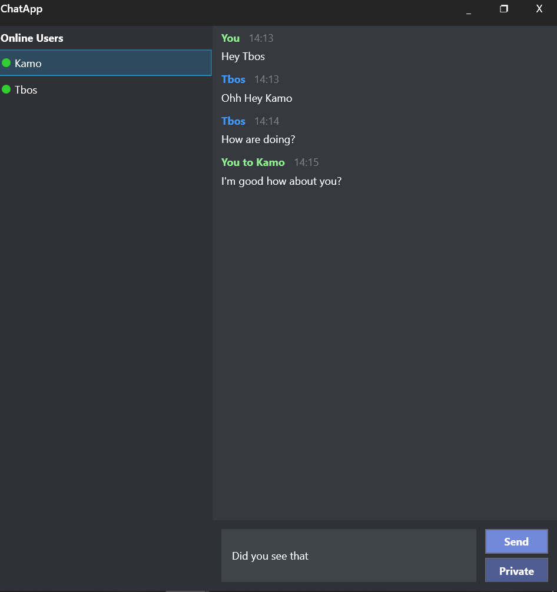
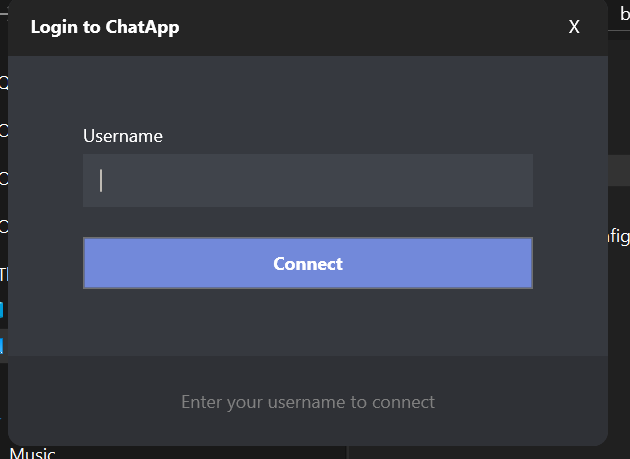
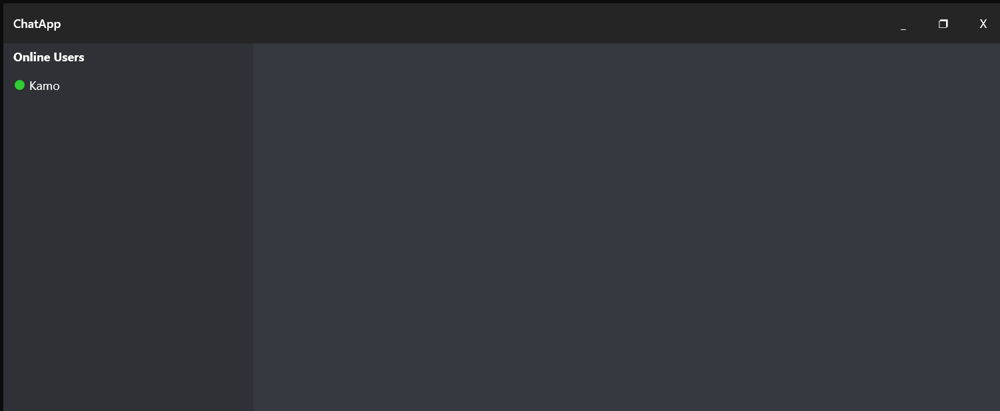
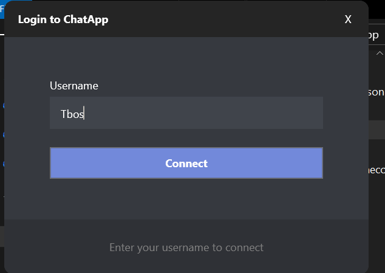
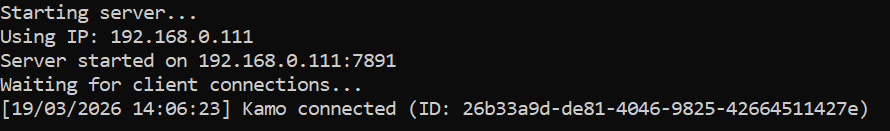

# Real-Time Messaging System (C#)

## 📌 Overview
This project is a real-time messaging application developed in C# using WPF. It enables multiple users to communicate over a network through a central server. The system demonstrates networking, client-server architecture, and real-time data exchange.

## 🚀 Features
- Real-time messaging between multiple clients
- Client-server architecture
- User connection and session handling
- LAN-based communication using IP addressing
- Multiple chat participants support
- Structured and responsive user interface (WPF)

## 🛠️ Technologies Used
- C#
- WPF (Windows Presentation Foundation)
- .NET Framework
- TCP/IP Sockets
- Visual Studio

## 🧠 System Architecture
The application follows a **client-server model**:

- The **server** handles:
  - Client connections
  - Message routing between clients
  - Managing active sessions

- The **client**:
  - Connects to the server via IP address
  - Sends and receives messages in real-time
  - Displays messages in a user-friendly interface

## 🔌 How It Works
1. Start the server application
2. Clients connect using the server’s IP address
3. Messages are sent from client → server → broadcast to other clients
4. All connected users receive messages instantly

## ▶️ How to Run
1. Clone the repository:
   ```bash
   git clone https://github.com/Kamogelo24/your-repo-name.git

   ## 📸 Screenshots

### Chat Interface







### Server Console
.png)




